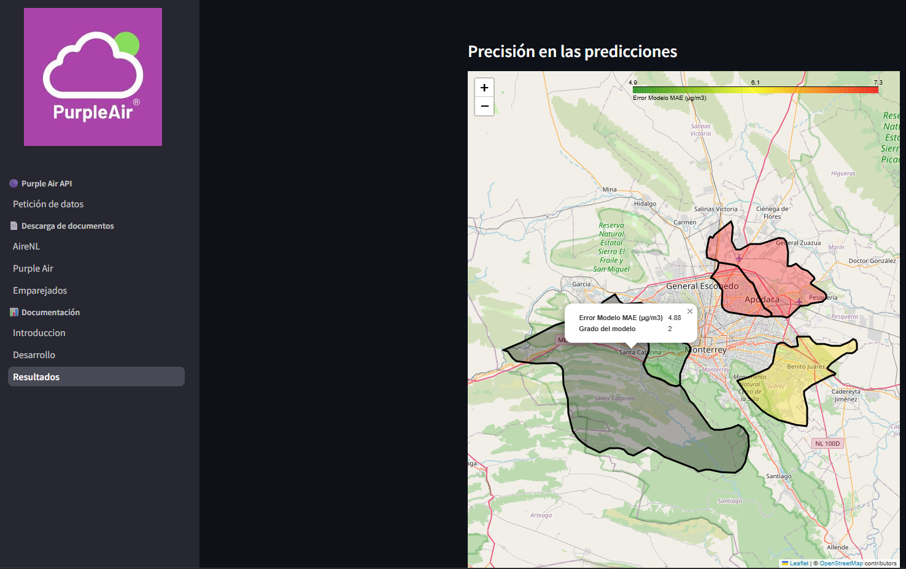

## About me 🧑‍💻
My name is José Antonio, I am a passionate data scientist who is constantly learning and looking for new projects to apply his knowledge and generate a great impact. I have had experience regarding data analysis and development of machine learning models but I am aware that there is something new to learn each day 📈.

🎓  Currently studying Data Science and Mathematics at the university Tecnológico de Monterrey  
🌱  I'm actively developing my expertise in data analysis, time series forecasting, machine learning, artificial intelligence, and DevOps, with a focus on applying these skills to solve real-world challenges.

## Projects 💼

### [FEMSA Hackathon Project – GIPlan](https://github.com/XJoseAntonioX/OXXO)

🛒 Smart planogram tool  

**Visualize, hear and read a complete guide on how to arrange products given a planogram: a csv file with locations of each product in rack, to workers in order to reduce margin of error at the moment of placing them.**  

⚙️ Technologies: 
-   
- 
- 

☁️ Azure AI & Cloud Services
- 

### [Microsoft Hackathon Project – Workable AI](https://github.com/ferDMS/ms-challenge)

🧩 Empowering job coaches, enabling careers

**AI-powered platform that assists employment coaches working with people with disabilities, enhancing productivity and job-matching outcomes.**  

⚙️ Technologies: 

  
  
  
  
  
  

☁️ Azure AI & Cloud Services

  
  
  
  

### [Cómite Ecológico Integral](https://github.com/XJoseAntonioX/PA-Reporte)

### Purple Air  

🌫️ Improving air quality data management and analysis  

**Streamlit-based web app that automates API requests, processes over 180,000 sensor records, and visualizes environmental data to support decision-making in Monterrey's metropolitan area.**  

Developed end-to-end data workflows: 
- Automated data ingestion via API,
- Preprocessing with pandas and numpy
- Visual analysis using matplotlib, seaborn, and plotly
- Performed geospatial analysis using geopandas and folium, alongside regression modeling with scikit-learn

⚙️ Technologies: 

  
  
  
  
  
  
  
  

### [Air quality analysis and forecasting](https://github.com/XJoseAntonioX/Air_quality_analysis_and_forecasting)

_Time series modeling (LSTM and regressions) to predict PM2.5 behavior across monitoring stations._

## Tech Stack 🛠

### 📊 Reports & Dashboards  
  
  

### ☁️ Cloud Platforms  
  

### 🧠 Machine Learning & Forecasting  
  

### ⚙️ Software Engineering & DevOps  
  
  
  
  
  
  
  
  

  

## GitHub Analytics ⚙️

&nbsp;

## Connect with Me 🤝

